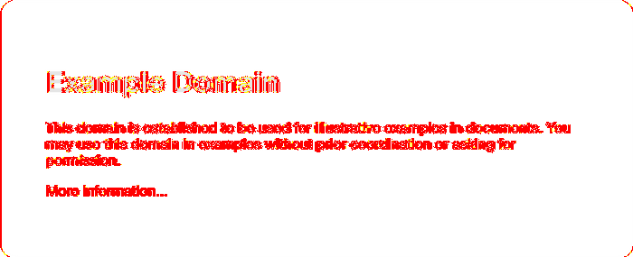
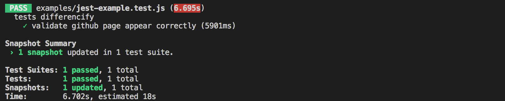
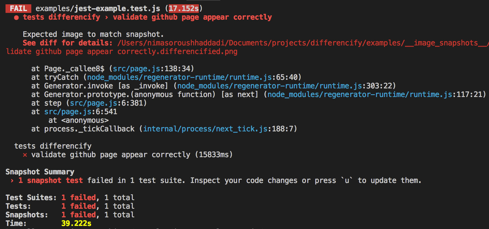
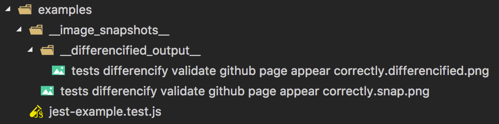

<p align="center">
<br>
<strong>Differencify</strong>
<br>
Regression Testing suite!
</p>
<br>

Status: [](https://circleci.com/gh/NimaSoroush/differencify/tree/master)

## About
Differencify is a library for visual regression testing by comparing your local changes with reference screenshots of your website. It is built on top of chrome headless using [Puppeteer](https://github.com/GoogleChrome/puppeteer)

|Reference|Local changes|
|---------|-------------|
|||


## Installation
Install the module:
```bash
npm install differencify
```
## Usage
```js
import Differencify from 'differencify';
const differencify = new Differencify(GlobalOptions);
```

### Validate your changes
```js
(async () => {
  const result = await differencify
    .init(TestOptions)
    .resize({ width: 1600, height: 1200 })
    .goto('https://github.com/NimaSoroush/differencify')
    .wait(3000)
    .capture()
    .close()
    .end();
  
  // or unchained

  const page = await differencify.init({ chain: false });
  await page.resize({ width: 1600, height: 1200 });
  await page.goto('https://github.com/NimaSoroush/differencify');
  await page.wait(3000);
  await page.capture();
  result = await page.close();

  console.log(result); // Prints true or false
})();
```

## Usage with <span style="color:#930a36">JEST</span>

Only need to add `toMatchSnapshot()` to your test steps.
```js
import Differencify from 'differencify';
const differencify = new Differencify();
describe('tests differencify', () => {
  afterAll(async () => {
    await differencify.cleanup();
  });
  it('validate github page appear correctly', async () => {
    await differencify
      .init()
      .goto('https://github.com/NimaSoroush/differencify')
      .capture()
      .toMatchSnapshot()
      .close()
      .end();
  });
});
```

### Test <span style="color:green">PASS</span>

<p align="center">

</p>

### Test <span style="color:red">FAIL</span>

<p align="center">

</p>

<p align="center">

</p>

Same way as Jest [snapshots testing](http://facebook.github.io/jest/docs/en/snapshot-testing.html), to update the snapshots, run jest with `--updateSnapshot` or `-u` argument.

## Usage with other test frameworks
If you are using other test frameworks you can still validate your tests. Differencify will return `true` or `false` by the end of execution. This could be used to assert on. look at the [example](https://github.com/NimaSoroush/differencify#validate-your-changes)

To Create/Update reference screenshots, simply set environment variable `update=true` and run the same code.

```
> update=true node test.js
```

## Debugging
It is possible to debug your tests execution by passing `debug:true` as global config in Differencify class. See full list of configs [below](https://github.com/NimaSoroush/differencify#globaloptions)

```js
const differencify = new Differencify({ debug: true });
```
<p align="center">

</p>

## Visible mode
By default differencify runs chrome in headless mode. If you want to see browser in non-headless mode set `headless:false` as global config in Differencify class. See full list of configs [below](https://github.com/NimaSoroush/differencify#globaloptions)

```js
const differencify = new Differencify({ headless: false });
```


## API

See [API.md](API.md) for full list of API calls

## GlobalOptions

|Parameter|type|required|description|default|
|---------|----|--------|-----------|-------|
|`headless`|`boolean`|no|Browser is launched in visible mode|true|
|`debug`|`boolean`|no|Enables console output|false|
|`timeout`|`integer` (ms)|no|Maximum time in milliseconds to wait for the Chrome instance to start|30000|
|`imageSnapshotPath`|`string`|no|Stores reference screenshots in this directory|./differencify_reports|
|`saveDifferencifiedImage`|`boolean`|no|Save differencified image to testReportPath in case of mismatch|true|
|`mismatchThreshold`|`integer`|no|Difference tolerance between reference/test image|0.001|
|`ignoreHTTPSErrors`|`boolean`|no|Whether to ignore HTTPS errors during navigation|false|
|`slowMo`|`integer`|no|Slows down browser operations by the specified amount of milliseconds|0|
|`browserArgs`|`Array`|no|Additional arguments to pass to the browser instance. List of Chromium flags can be found [here](http://peter.sh/experiments/chromium-command-line-switches/)|[]|
|`dumpio`|`boolean`|no|Whether to pipe browser process stdout and stderr into process.stdout and process.stderr|false|

## TestOptions

|Parameter|type|required|description|default|
|---------|----|--------|-----------|-------|
|`testName`|`string`|no|Unique name for your test case|test|
|`newWindow`|`boolean`|no|Whether to open test execution on new browser window or not. By default it opens on new tab|false|
|`chain`|`boolean`|no|Whether to chain differencify commands or not. More details on [examples](examples)|true|

## Steps API

See [API.md](API.md) for full list of Steps API calls


## Interested on Docker image!

A [Dockerfile](Dockerfile) with chrome-headless is available for local and CI usage

Build the container:

```docker build -t puppeteer-chrome-linux .```

Run the container by passing node -e "<yourscript.js content as a string> as the command:

```docker run -i --rm --name puppeteer-chrome puppeteer-chrome-linux node -e "`cat yourscript.js`"```


## Links

See [examples](examples) for usages and CI integration with jest

See [CONTRIBUTING.md](CONTRIBUTING.md) if you want to contribute.
