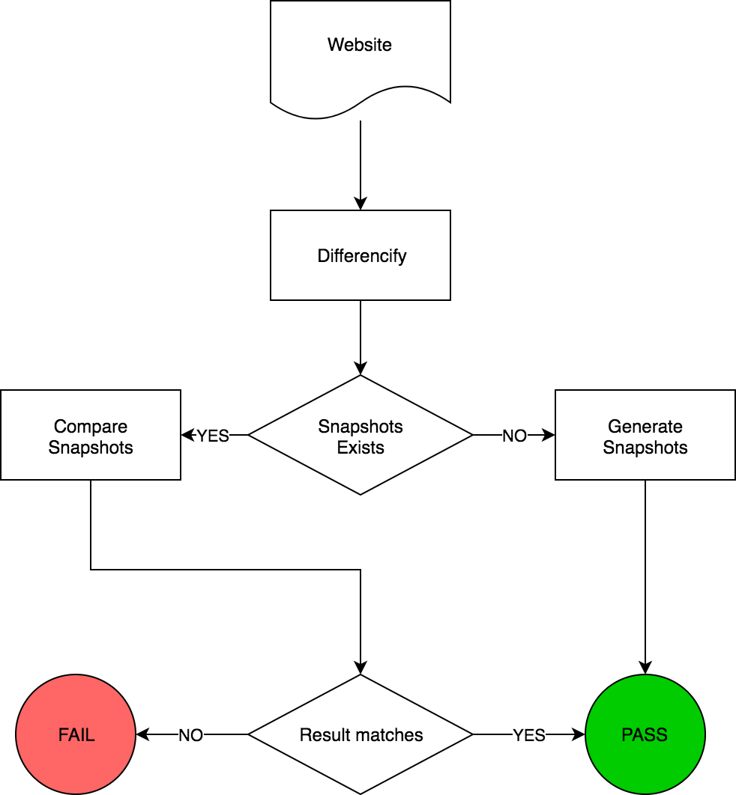

<p align="center">
<br>
<strong>Differencify </strong>
<br>
Regression Testing suite!
</p>
<br>

[](https://circleci.com/gh/NimaSoroush/differencify/tree/master) 
[](https://badge.fury.io/js/differencify) [](https://greenkeeper.io/)
<a href="https://github.com/jest-community/awesome-jest"></a>

## About
Differencify is a library for visual regression testing by comparing your local changes with reference screenshots of your website. It is built on top of chrome headless using [Puppeteer](https://github.com/GoogleChrome/puppeteer)

|Reference|Local changes|
|---------|-------------|
|||

## How it works
<p align="center"></p>


## Installation
> *Note: Differencify uses async/await and targets Node v7.6.0 or greater* 

Install the module:
```bash
npm install differencify
```
## Usage
```js
const Differencify = require('differencify');
const differencify = new Differencify(GlobalOptions);
```

Differencify matches [Puppeteer](https://github.com/GoogleChrome/puppeteer/blob/master/docs/api.md)'s API completely. Look at [API.md](API.md) for more details.

### Validate your changes
```js
(async () => {
  const result = await differencify
    .init(TestOptions)
    .launch()
    .newPage()
    .setViewport({ width: 1600, height: 1200 })
    .goto('https://github.com/NimaSoroush/differencify')
    .waitFor(1000)
    .screenshot()
    .toMatchSnapshot()
    .result((result) => {
      console.log(result); // Prints true or false
    })
    .close()
    .end();
  
  // or unchained
  
  const target = differencify.init({ chain: false });
  await target.launch();
  const page = await target.newPage();
  await page.setViewport({ width: 1600, height: 1200 });
  await page.goto('https://github.com/NimaSoroush/differencify');
  await page.waitFor(1000);
  const image = await page.screenshot();
  const result = await target.toMatchSnapshot(image)
  await page.close();
  await target.close();

  console.log(result); // Prints true or false
})();
```
See more examples [here](API.md)

## Usage with <span style="color:#930a36">JEST</span>

Only need to wrap your steps into `it()` function
```js
const differencify = new Differencify();
describe('tests differencify', () => {
  it('validate github page appear correctly', async () => {
    await differencify
      .init()
      .launch()
      .newPage()
      .goto('https://github.com/NimaSoroush/differencify')
      .screenshot()
      .toMatchSnapshot()
      .close()
      .end();
  });
});
```
As you can see, you don't need to return `result` as `toMatchSnapshot` will automatically validate result. See more jest examples [here](src/integration.tests/integration.test.js).

### Test <span style="color:green">PASS</span>

<p align="center">

</p>

### Test <span style="color:red">FAIL</span>

<p align="center">

</p>

<p align="center">

</p>

Same way as Jest [snapshots testing](http://facebook.github.io/jest/docs/en/snapshot-testing.html), to update the snapshots, run jest with `--updateSnapshot` or `-u` argument.

## Usage with other test frameworks
If you are using other test frameworks you can still validate your tests. Differencify will return `true` or `false` by the end of execution. This could be used to assert on. look at the [example](https://github.com/NimaSoroush/differencify#validate-your-changes)

To Create/Update reference screenshots, simply set environment variable `update=true` and run the same code.

```
> update=true node test.js
```

## Debugging
It is possible to debug your tests execution by passing `debug:true` as global config in Differencify class. See full list of configs [below](https://github.com/NimaSoroush/differencify#globaloptions)

```js
const differencify = new Differencify({ debug: true });
```
<p align="center">

</p>

## Visible mode
By default differencify runs chrome in headless mode. If you want to see browser in non-headless mode set `headless:false` when launching browser. See more details [here](https://github.com/GoogleChrome/puppeteer/blob/master/docs/api.md#puppeteerlaunchoptions)

```js
const differencify = new Differencify();
(async () => {
  await differencify
    .init()
    .launch({ headless: false })
    .newPage()
    .goto('https://github.com/NimaSoroush/differencify')
    .screenshot()
    .toMatchSnapshot()
    .close()
    .end();
})();
```


## API

See [API.md](API.md) for full list of API calls

## GlobalOptions

|Parameter|type|required|description|default|
|---------|----|--------|-----------|-------|
|`debug`|`boolean`|no|Enables console output|false|
|`imageSnapshotPath`|`string`|no|Stores reference screenshots in this directory|./differencify_reports|
|`saveDifferencifiedImage`|`boolean`|no|Save differencified image to testReportPath in case of mismatch|true|
|`mismatchThreshold`|`integer`|no|Difference tolerance between reference/test image|0.001|

## TestOptions

|Parameter|type|required|description|default|
|---------|----|--------|-----------|-------|
|`testName`|`string`|no|Unique name for your test case|test|
|`chain`|`boolean`|no|Whether to chain differencify commands or not. More details on [examples](examples)|true|

## Steps API

See [API.md](API.md) for full list of API calls and examples


## Interested on Docker image!

A [Docker base image](https://hub.docker.com/r/nimasoroush/differencify/) available for local and CI usage based on this [Dockerfile](Docker/Dockerfile). To see an example look at this [Dockerfile](Dockerfile)

Usage:

```
FROM nimasoroush/differencify
RUN npm install differencify
...
```


## Links

See [examples](./src/integration.tests) for usages and CI integration with jest

Visit project [Gitter Chat](https://gitter.im/differencify/QA) for general Q/A around project

See [CONTRIBUTING.md](CONTRIBUTING.md) if you want to contribute.

Read [this article](https://medium.com/@nima.soroush.h/make-visual-regression-testing-easier-4a3dc7073737) that explain simple usage of this library

Article about how to use [Differencify in Docker](https://medium.com/@nima.soroush.h/using-differencify-in-docker-and-ci-99e3d1ec057c)

[Gist example](https://gist.github.com/NimaSoroush/28c3a5808af393610a33bd32d4c43911) with vanilla node
